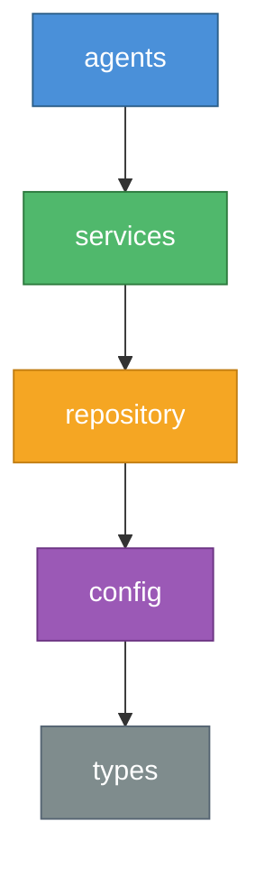

# Harness Engineering

[](https://github.com/Intense-Visions/harness-engineering/actions/workflows/ci.yml)
[](https://opensource.org/licenses/MIT)
[](https://pnpm.io/)

**Mechanical constraints for AI agents. Ship faster without the chaos.**

## Why This Exists

AI coding agents are powerful, but unreliable without structure. Left unconstrained, they introduce circular dependencies, violate architectural boundaries, and generate drift that compounds across a codebase. Teams respond with code review backlogs and manual checklists — trading agent speed for human bottlenecks.

Harness Engineering takes a different approach: **mechanical enforcement, not hope.**

Instead of relying on prompts and conventions, harness encodes your architectural decisions as machine-checkable constraints. Agents get real-time feedback when they violate boundaries. Entropy is detected and cleaned automatically. Every rule is validated on every change.

**For tech leads and architects:** Scale AI-assisted development across your team with confidence. Define constraints once, enforce them everywhere — across agents, developers, and CI.

**For individual developers:** Stop babysitting your AI agent. Give it guardrails and let it execute. Spend your time on design decisions, not cleanup.

## Key Features

- **Context Engineering** — Repository-as-documentation keeps agents grounded in project reality, not stale training data
- **Architectural Constraints** — Layered dependency rules enforced by ESLint, not willpower
- **Agent Feedback Loop** — Self-correcting agents with peer review and real-time validation
- **Entropy Management** — Automated detection of dead code, doc drift, and structural decay
- **Implementation Strategy** — Depth-first execution: one feature to 100% before the next begins
- **Key Performance Indicators** — Measure agent autonomy, harness coverage, and context density

## Quick Start

### 1. Install and generate global skills + personas

```bash
npm install -g @harness-engineering/cli
harness generate --global
```

This installs the CLI, the MCP server, and writes slash commands and agent definitions to your global config directories (`~/.claude/commands/`, `.gemini/` etc.). Once generated, every project on your machine has access to `/harness:*` slash commands, agent personas, and the `harness-mcp` server binary — no per-project setup needed.

> **Tip:** Re-run `harness generate --global` after updating the CLI (`harness update`) to pick up new or changed skills.

### 2. Scaffold a new project

In an AI agent session (Claude Code, Gemini CLI):

```
/harness:initialize-project
```

The initialization skill walks you through project setup interactively — name, adoption level, framework overlay — and scaffolds everything including MCP server configuration.

> **CLI alternative** (for scripts or CI): `harness init --name my-project --level intermediate`

### 3. Validate

```
/harness:verify
```

Runs all mechanical checks in one pass — configuration, dependency boundaries, lint, typecheck, and tests.

> **CLI alternative:** `harness validate && harness check-deps`

### Explore an example

```bash
git clone https://github.com/Intense-Visions/harness-engineering.git
cd harness-engineering/examples/hello-world
npm install && harness validate
```

## Packages

| Package                                                          | Description                                                                                                                                                                                                                          |
| ---------------------------------------------------------------- | ------------------------------------------------------------------------------------------------------------------------------------------------------------------------------------------------------------------------------------ |
| [`@harness-engineering/types`](./packages/types)                 | Shared TypeScript types and interfaces                                                                                                                                                                                               |
| [`@harness-engineering/core`](./packages/core)                   | Validation, constraints, entropy detection, state management                                                                                                                                                                         |
| [`@harness-engineering/cli`](./packages/cli)                     | CLI: `validate`, `check-deps`, `skill run`, `state show`                                                                                                                                                                             |
| [`@harness-engineering/eslint-plugin`](./packages/eslint-plugin) | 10 rules: layer violations, circular deps, forbidden imports, boundary schemas, doc exports, no nested loops in critical paths, no sync IO in async, no unbounded array chains, no unix shell commands, no hardcoded path separators |
| [`@harness-engineering/linter-gen`](./packages/linter-gen)       | Generate custom ESLint rules from YAML configuration                                                                                                                                                                                 |
| [`@harness-engineering/mcp-server`](./packages/mcp-server)       | MCP server with 41 tools and 8 resources for AI agent integration                                                                                                                                                                    |
| [`@harness-engineering/graph`](./packages/graph)                 | Knowledge graph for codebase relationships and entropy detection                                                                                                                                                                     |

## Usage

```typescript
import { validateConfig } from '@harness-engineering/core';
import { HarnessConfigSchema } from '@harness-engineering/cli';

const result = validateConfig(configData, HarnessConfigSchema);
if (!result.ok) {
  console.error('Validation failed:', result.error.message);
  process.exit(1);
}
```

```bash
# CLI — validate project constraints
harness validate

# Check architectural dependency boundaries
harness check-deps

# Run a skill
harness skill run harness-verification
```

See [Getting Started](./docs/guides/getting-started.md) for a full walkthrough.

## Architecture

Harness enforces a strict layered dependency model. Each layer may only import from layers below it.



Violations are caught at lint time via `@harness-engineering/eslint-plugin` — not at code review.

## AI Agent Integration

### Global setup (one-time)

Install the CLI, MCP server, skills, and personas so they're available in every project:

```bash
npm install -g @harness-engineering/cli
harness generate --global
```

The single `npm install -g` provides both the `harness` CLI and the `harness-mcp` server binary, with all dependencies version-matched. `harness generate --global` then writes to your global config directories:

| Platform    | Slash Commands            | Agent Definitions |
| ----------- | ------------------------- | ----------------- |
| Claude Code | `~/.claude/commands/`     | `.claude/agents/` |
| Gemini CLI  | `.gemini/customCommands/` | `.gemini/agents/` |

After this, `/harness:*` slash commands and harness agent personas are available in every conversation — no per-project install needed.

### Per-project MCP server

For real-time constraint validation, connect the MCP server to your project. The easiest way is during initialization:

```
/harness:initialize-project
```

This scaffolds your project **and** configures the MCP server automatically.

To add the MCP server to an existing project:

```bash
harness setup-mcp
```

This gives your AI agent access to 41 tools (validation, entropy detection, skill execution, state management, code review, graph queries, and more) and 8 resources (project context, skills catalog, rules, learnings, state, graph, entities, relationships).

<details>
<summary>Manual MCP setup</summary>

**Claude Code** — add to `.mcp.json` in your project root:

```json
{
  "mcpServers": {
    "harness": {
      "command": "harness-mcp"
    }
  }
}
```

**Gemini CLI** — add to `.gemini/settings.json` in your project root:

```json
{
  "mcpServers": {
    "harness": {
      "command": "harness-mcp"
    }
  }
}
```

Then add your project directory to `~/.gemini/trustedFolders.json` (Gemini ignores workspace MCP servers in untrusted folders):

```json
{
  "/path/to/your/project": "TRUST_FOLDER"
}
```

> **Note:** `harness-mcp` is installed alongside the CLI by `npm install -g @harness-engineering/cli`. Using the installed binary instead of `npx @harness-engineering/mcp-server` avoids stale npx cache issues and ensures the MCP server uses the same package versions as the CLI.

</details>

| Client      | MCP Config Location     | Additional Setup                               |
| ----------- | ----------------------- | ---------------------------------------------- |
| Claude Code | `.mcp.json`             | None                                           |
| Gemini CLI  | `.gemini/settings.json` | Add project to `~/.gemini/trustedFolders.json` |

## What's Included

| Component                              | Count | Description                                                                         |
| -------------------------------------- | ----- | ----------------------------------------------------------------------------------- |
| [Packages](./packages/)                | 7     | Core library, CLI, ESLint plugin, linter generator, MCP server, graph, shared types |
| [Skills](./agents/skills/claude-code/) | 49    | Agent workflows for TDD, execution, debugging, verification, planning, and more     |
| [Personas](./agents/personas/)         | 12    | Architecture enforcer, code reviewer, planner, verifier, task executor, and 7 more  |
| [Templates](./templates/)              | 5     | Base, basic, intermediate, advanced, and Next.js scaffolds                          |
| [Examples](./examples/)                | 3     | Progressive tutorials from 5 minutes to 30 minutes                                  |

## Examples

Learn by doing. Each example builds on the previous:

| Example                                          | Level        | Time   | What You Learn                                                               |
| ------------------------------------------------ | ------------ | ------ | ---------------------------------------------------------------------------- |
| [Hello World](./examples/hello-world/)           | Basic        | 5 min  | Config, validation, AGENTS.md — see what a harness project looks like        |
| [Task API](./examples/task-api/)                 | Intermediate | 15 min | Express API with 3-layer architecture enforced by ESLint                     |
| [Multi-Tenant API](./examples/multi-tenant-api/) | Advanced     | 30 min | Custom linter rules, Zod boundary validation, personas, full state lifecycle |

## Documentation

**Getting Started**

- [Getting Started Guide](./docs/guides/getting-started.md) — From zero to validated project
- [Day-to-Day Workflow](./docs/guides/day-to-day-workflow.md) — Full lifecycle tutorial using slash commands
- [Best Practices](./docs/guides/best-practices.md) — Patterns for effective harness usage
- [Agent Worktree Patterns](./docs/guides/agent-worktree-patterns.md) — Running multiple agents in parallel

**Core Concepts**

- [The Core Principles](./docs/standard/principles.md) — Foundational concepts behind harness engineering
- [Implementation Guide](./docs/standard/implementation.md) — Adoption levels and rollout strategy
- [KPIs](./docs/standard/kpis.md) — Measuring agent effectiveness

**Reference**

- [CLI Reference](./docs/reference/cli.md) — All commands and flags (for CI/scripts)
- [Configuration Reference](./docs/reference/configuration.md) — `harness.config.json` schema

## Contributing

See [CONTRIBUTING.md](./CONTRIBUTING.md) for development setup, coding standards, and pull request guidelines.

## License

MIT License — see [LICENSE](./LICENSE) for details.
