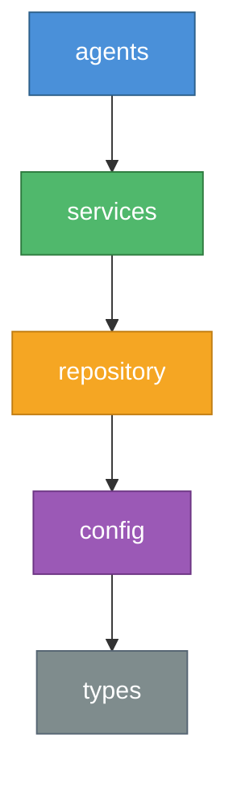

# Harness Engineering

[](https://github.com/harness-engineering/harness-engineering/actions/workflows/ci.yml)
[](https://opensource.org/licenses/MIT)
[](https://pnpm.io/)

**Mechanical constraints for AI agents. Ship faster without the chaos.**

## Why This Exists

AI coding agents are powerful, but unreliable without structure. Left unconstrained, they introduce circular dependencies, violate architectural boundaries, and generate drift that compounds across a codebase. Teams respond with code review backlogs and manual checklists — trading agent speed for human bottlenecks.

Harness Engineering takes a different approach: **mechanical enforcement, not hope.**

Instead of relying on prompts and conventions, harness encodes your architectural decisions as machine-checkable constraints. Agents get real-time feedback when they violate boundaries. Entropy is detected and cleaned automatically. Every rule is validated on every change.

**For tech leads and architects:** Scale AI-assisted development across your team with confidence. Define constraints once, enforce them everywhere — across agents, developers, and CI.

**For individual developers:** Stop babysitting your AI agent. Give it guardrails and let it execute. Spend your time on design decisions, not cleanup.

## Key Features

- **Context Engineering** — Repository-as-documentation keeps agents grounded in project reality, not stale training data
- **Architectural Constraints** — Layered dependency rules enforced by ESLint, not willpower
- **Agent Feedback Loop** — Self-correcting agents with peer review and real-time validation
- **Entropy Management** — Automated detection of dead code, doc drift, and structural decay
- **Implementation Strategy** — Depth-first execution: one feature to 100% before the next begins
- **Key Performance Indicators** — Measure agent autonomy, harness coverage, and context density

## Quick Start

```bash
# Install the CLI
npm install -g @harness-engineering/cli

# Scaffold a new project
harness init my-project

# Validate constraints
harness validate
```

Or explore an example directly:

```bash
git clone https://github.com/harness-engineering/harness-engineering.git
cd harness-engineering/examples/hello-world
npm install && harness validate
```

## Packages

| Package | Description |
| --- | --- |
| [`@harness-engineering/types`](./packages/types) | Shared TypeScript types and interfaces |
| [`@harness-engineering/core`](./packages/core) | Validation, constraints, entropy detection, state management |
| [`@harness-engineering/cli`](./packages/cli) | CLI: `validate`, `check-deps`, `skill run`, `state show` |
| [`@harness-engineering/eslint-plugin`](./packages/eslint-plugin) | 5 rules: layer violations, circular deps, forbidden imports, boundary schemas, doc exports |
| [`@harness-engineering/linter-gen`](./packages/linter-gen) | Generate custom ESLint rules from YAML configuration |
| [`@harness-engineering/mcp-server`](./packages/mcp-server) | MCP server with 15 tools for AI agent integration |

## Architecture

Harness enforces a strict layered dependency model. Each layer may only import from layers below it.



Violations are caught at lint time via `@harness-engineering/eslint-plugin` — not at code review.

## What's Included

| Component | Count | Description |
| --- | --- | --- |
| [Packages](./packages/) | 6 | Core library, CLI, ESLint plugin, linter generator, MCP server, shared types |
| [Skills](./agents/skills/claude-code/) | 26 | Agent workflows for TDD, execution, debugging, verification, planning, and more |
| [Personas](./agents/personas/) | 3 | Architecture enforcer, documentation maintainer, entropy cleaner |
| [Templates](./templates/) | 5 | Base, basic, intermediate, advanced, and Next.js scaffolds |
| [Examples](./examples/) | 3 | Progressive tutorials from 5 minutes to 30 minutes |

## Examples

Learn by doing. Each example builds on the previous:

| Example | Level | Time | What You Learn |
| --- | --- | --- | --- |
| [Hello World](./examples/hello-world/) | Basic | 5 min | Config, validation, AGENTS.md — see what a harness project looks like |
| [Task API](./examples/task-api/) | Intermediate | 15 min | Express API with 3-layer architecture enforced by ESLint |
| [Multi-Tenant API](./examples/multi-tenant-api/) | Advanced | 30 min | Custom linter rules, Zod boundary validation, personas, full state lifecycle |

## Documentation

**Getting Started**
- [Getting Started Guide](./docs/guides/getting-started.md) — From zero to validated project
- [Best Practices](./docs/guides/best-practices.md) — Patterns for effective harness usage
- [Agent Worktree Patterns](./docs/guides/agent-worktree-patterns.md) — Running multiple agents in parallel

**Core Concepts**
- [The Six Principles](./docs/standard/principles.md) — Foundational concepts behind harness engineering
- [Implementation Guide](./docs/standard/implementation.md) — Adoption levels and rollout strategy
- [KPIs](./docs/standard/kpis.md) — Measuring agent effectiveness

**API Reference**
- [CLI Reference](./docs/reference/cli.md) — All commands and flags
- [Configuration Reference](./docs/reference/configuration.md) — `harness.config.yaml` schema

## Contributing

See [CONTRIBUTING.md](./CONTRIBUTING.md) for development setup, coding standards, and pull request guidelines.

## License

MIT License — see [LICENSE](./LICENSE) for details.
